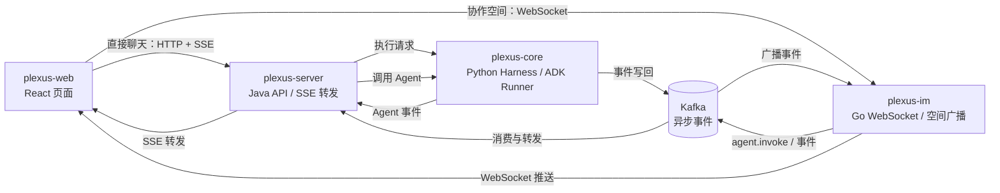
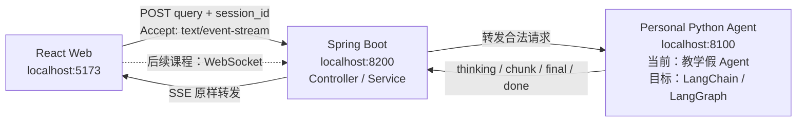
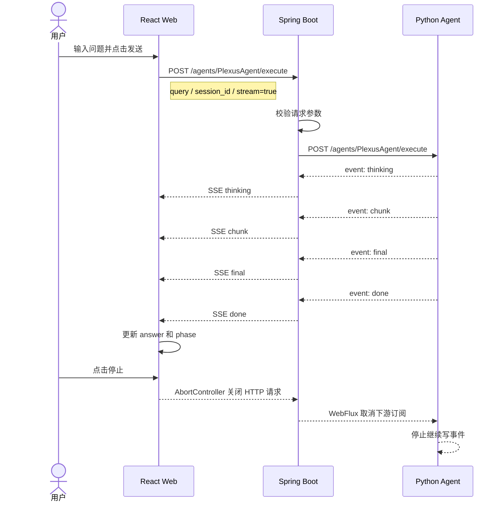

# 第一节课学习笔记：整体架构与聊天链路

这份笔记对应课程大纲中的第一节课，记录已经理解和验证过的内容。课程目标和作业要求保留在原课程大纲中：[01-architecture.md](../../plexus/docs/course/01-architecture.md)。

## 1. 服务职责与边界

| 模块 | 职责 | 边界的意义 |
|---|---|---|
| `plexus-web` | React 前端，收集输入、发请求、解析事件、维护界面状态、渲染消息 | 不执行 Agent，不直接决定调用哪个工具 |
| `plexus-server` | Java/Spring 接口、认证、参数处理、SSE 转发及部分后端业务 | 让浏览器不直接暴露或依赖 Python Core |
| `plexus-core` | 原项目 Python Agent 执行层，组织 ADK Runner、LLM、工具、会话历史并产生执行事件 | 作为企业级执行框架的架构参照；个人项目不直接依赖它 |
| `plexus-im` | Go 实时连接、WebSocket 会话、空间广播 | 处理多人在线消息分发，不等同于直接 Agent SSE |

划分边界的实际意义是：出现问题时可以定位责任（传输、转发、Agent 执行或界面状态），替换一层时不必重写其他层，并能分别扩展直接聊天和协作空间。

个人项目目前采用的最小边界是：React 负责页面交互和状态，Spring Boot 负责入口、校验、错误和转发，Python Agent 负责模型推理、工具调用和事件产生。

## 2. 直接 Agent 对话链路

```text
React sendMessageSSE
  -> Java POST /api/agents/{name}/execute
  -> Python Agent 层
  -> SSE 事件
  -> Java 转发 SSE
  -> Web parseSSEStream
  -> parseSSEEvent
  -> ChatModule.handleAgentEvent
  -> chatStore action
  -> React 重新渲染
```

`query` 是本轮文本，`session_id` 关联多轮会话，`stream: true` 表示持续返回 SSE 事件，不是二进制流。

原 Plexus 的 Python Agent 层是 `plexus-core` 的 Harness / ADK Runner；AtlasMind 会将同一传输边界接到独立的 LangChain/LangGraph Agent。个人项目学习的是边界和事件协议，不要求直接在 `plexus-core` 的执行引擎内实现 Agent。

```text
Plexus 原项目：Java Server -> plexus-core Harness / ADK Runner
AtlasMind：Java Server -> Personal Python Agent (LangChain/LangGraph)
```

## 3. SSE 与前端状态

SSE 是 HTTP 上的单向文本事件流，事件通常以空行（`\\n\\n`）分隔。网络分块不等于事件边界，所以解析器需要用 `buffer` 拼接不完整内容。

| 事件 | 含义 | 前端动作 |
|---|---|---|
| `thinking` | Agent 正在准备 | 更新准备状态 |
| `chunk` | 一段增量回答 | 把 `content` 追加到当前回答 |
| `final` | 完整回答内容 | 用完整内容覆盖当前回答 |
| `done` | SSE 传输结束 | 标记完成，不提供回答正文 |
| `error` | 执行或传输错误 | 显示错误或结束当前请求 |

`parseSSEEvent` 将后端原始事件转换为前端统一的 `ParsedAgentEvent`。`handleAgentEvent` 是分发函数，真正修改状态的是 `chatStore` 的 action，例如 `appendAIThinking`、`appendToLastAIMessage`。

## 4. WebSocket、Kafka 与协作空间

协作空间使用 WebSocket 长连接：客户端可发送，服务端可主动推送。浏览器端通过 `SocketManager` 发送二进制协议帧，Go IM 在 `/ws` 接收并处理。

Kafka 用于事件持久化、异步解耦和消费，不是全局严格排序队列；通常只保证同一 partition 内顺序。Go IM 的 Consumer 从 Kafka 取事件后，将其映射为 `OpPushMsg`、`OpAgentChunk`、`OpAgentDone` 等 WebSocket 操作并广播。

## 5. Plexus 原项目架构图



直接聊天和协作空间共享 Agent 执行能力，但使用不同的接入方式：前者是一次 HTTP 请求对应一条 SSE 流，后者是长连接上的多人事件广播。

## 6. AtlasMind 当前目标架构图



个人项目保留了“浏览器不直接调用 Agent”的边界。Java 负责入口、校验、错误和流转发；Python Agent 负责模型、工具和执行过程。个人 Agent 后续使用 LangChain/LangGraph，不放回原项目的 `plexus-core`。

## 7. 一次直接聊天的时序图



如果参数校验失败，时序会在 Java 的校验步骤结束，Python Agent 不会被调用；如果 Agent 已经开始返回 SSE，错误必须使用事件或断开来表达，不能再把响应头改成普通 JSON。

## 8. 个人项目的 5 个核心用例

| 用例 | 主要服务 | 当前状态 |
|---|---|---|
| 登录并进入工作台 | React、Spring Boot、PostgreSQL | 后续课程 |
| 直接 AI 对话、流式显示并支持停止 | React、Spring Boot、Personal Python Agent、SSE | 已完成最小链路 |
| 上传资料并建立可问答的知识材料 | React、Spring Boot、Python 文档处理、文件/向量存储 | 后续课程 |
| 搜索个人知识 | React、Spring Boot、Python Agent、向量检索 | 后续课程 |
| 管理个人待办 | React、Spring Boot、PostgreSQL | 后续课程 |

“停止生成”是直接 AI 对话用例中的一个交互流程，不单独算成一个业务用例。这样可以区分业务目标和技术动作。

## 9. 本节代码对应关系

| 学习概念 | 个人项目代码 |
|---|---|
| React 发起请求、解析 SSE、维护状态 | [web/src/main.tsx](../web/src/main.tsx) |
| Vite `/api` 代理 | [web/vite.config.ts](../web/vite.config.ts) |
| Java HTTP 接口和参数校验 | [AgentController.java](../server-spring/src/main/java/com/plexus/personal/AgentController.java)、[ChatRequest.java](../server-spring/src/main/java/com/plexus/personal/ChatRequest.java) |
| Java 转发 Python SSE | [AgentService.java](../server-spring/src/main/java/com/plexus/personal/AgentService.java) |
| 统一参数和 Agent 错误 | [GlobalExceptionHandler.java](../server-spring/src/main/java/com/plexus/personal/GlobalExceptionHandler.java)、[ApiError.java](../server-spring/src/main/java/com/plexus/personal/ApiError.java) |
| Python 事件生成和断连处理 | [core/app.py](../core/app.py) |
| Python SSE 客户端解析器 | [core/client.py](../core/client.py) |

## 10. 已验证结果

- 正常请求可以收到 `thinking -> chunk -> final -> done`。
- 空 `query` 返回 `400 VALIDATION_ERROR`，不会调用 Python Agent。
- Python Core 不可用时，Spring 返回 `503 AGENT_UNAVAILABLE`。
- 点击停止后，React 进入“已停止”，Spring 收到取消，Python 停止继续写 SSE。
- React 构建和 Spring Boot Maven 打包均已成功。
